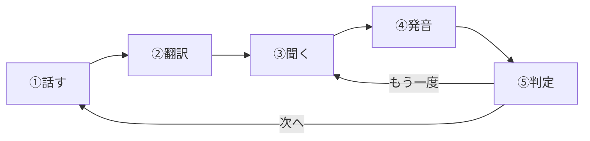

# ParrotTranslator ユーザーマニュアル
[English doc](USER_MANUAL_EN.md)

## 目次

1. [概要](#概要)
2. [使い方](#使い方)
3. [設定画面](#設定画面)
4. [学習履歴画面](#学習履歴画面)
5. [トラブルシューティング](#トラブルシューティング)

---

## 概要

音声で言語学習するアプリです。母語で話した内容を目標言語に翻訳し、発音を練習できます。

---

## 使い方

### 学習の流れ

> [!NOTE]
> **母語と目標言語の選択**は、学習開始時に表示される画面で選択します。

1. **話す**: マイクボタンをタップして母語で話す
2. **翻訳**: 自動的に学習言語へ翻訳
3. **聞く**: 翻訳結果の発音を聞く
4. **発音**: 聞いた通りに発音する
5. **判定**: 類似度80%以上で合格（設定で変更可能）

### 音声コマンド

結果画面で自然に話しかけるとコマンドを認識します：

| コマンド         | 動作   |
| ---------------- | ------ |
| Next / 次        | 次へ   |
| Again / もう一度 | 再試行 |
| Finish / 終了    | 終了   |

---

## 設定画面

### システム設定

| 項目               | 説明                       |
| ------------------ | -------------------------- |
| **カラースキーム** | システム / ライト / ダーク |

> [!NOTE]
> アプリ表示言語は、iOS設定の「優先する言語」に従います。

### 言語設定

| 項目               | 説明                                                                                            |
| ------------------ | ----------------------------------------------------------------------------------------------- |
| **言語モデル管理** | 音声認識用の言語モデルをダウンロード/削除。オフライン使用時は必須。母語と目標言語もここで選択。 |

### 音声設定

| 項目             | 説明                                                                       |
| ---------------- | -------------------------------------------------------------------------- |
| **スピーカー**   | 読み上げ音声の種類                                                         |
| **読み上げ速度** | 0.1〜1.0（初心者は遅め推奨） ※ 調整可能範囲は課金プランにより異なります |
| **効果音の音量** | 0%〜100%                                                                   |

### 発音評価設定

| 項目                     | 説明                                               |
| ------------------------ | -------------------------------------------------- |
| **発音判定を有効にする** | 発音評価機能のON/OFF                               |
| **類似度しきい値**       | 50%〜100%（初心者は50〜70%、上級者は80〜100%推奨） |

### 音声コマンド設定

| 項目                          | 説明                                 |
| ----------------------------- | ------------------------------------ |
| **音声コマンド言語**          | コマンド認識に使用する言語           |
| **Next/Again/Finishコマンド** | 各コマンドのカスタマイズ             |
| **コマンド類似度しきい値**    | コマンド認識の最低類似度（0%〜100%） |

### 情報

- **課金プラン**: 現在のプランを確認・変更
- **使い方**: アプリの使い方ガイド
- **アプリについて**: バージョン・開発者・ライセンス情報
- **プライバシーポリシー**: プライバシーポリシーを表示

---

## 学習履歴画面

### 履歴の表示

各履歴には以下の情報が記録されます：

- 日時
- 元のテキスト（母語）
- 翻訳結果（目標言語）
- 発音結果
- 類似度

### 操作

| 操作                | 説明                                       |
| ------------------- | ------------------------------------------ |
| **タップ**          | 履歴の詳細を表示                           |
| **再挑戦**          | 同じ問題をもう一度練習                     |
| **左スワイプ**      | 異常報告（翻訳・認識の問題を報告）         |
| **右スワイプ**      | 個別の履歴を削除                           |
| **統計情報**        | 成功率・学習回数などをグラフ表示           |
| **全削除**          | メニューから全履歴を削除                   |
| **CSVエクスポート** | 履歴をCSVファイルでエクスポート（Pro以上） |

---

## トラブルシューティング

| 問題               | 対処法                                                                |
| ------------------ | --------------------------------------------------------------------- |
| 音声認識が動かない | マイク許可を確認 / オンデバイス認識ONの場合は言語モデルをダウンロード |
| 翻訳できない       | 対応言語ペアか確認 / インターネット接続を確認                         |
| 音声が出ない       | デバイスの音量を確認 / 効果音の音量設定を確認                         |
| 判定が厳しい/甘い  | 類似度しきい値を調整（初心者50〜70%、上級者80〜100%）                 |

---

**最終更新日**: 2026年2月4日
