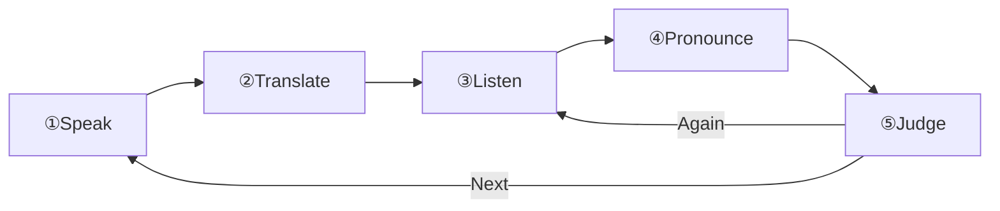

# ParrotTranslator User Manual

[日本語のドキュメント](USER_MANUAL.md)

## Table of Contents

1. [Overview](#overview)
2. [How to Use](#how-to-use)
3. [Settings Screen](#settings-screen)
4. [Learning History Screen](#learning-history-screen)
5. [Troubleshooting](#troubleshooting)

---

## Overview

A language learning app using voice. Translate what you say in your native language into your target language and practice pronunciation.

---

## How to Use

### Learning Flow

> [!NOTE]
> **Native and target language selection** is done on the screen displayed when starting a learning session.

1. **Speak**: Tap the mic and speak in your native language
2. **Translate**: Automatically translated to learning language
3. **Listen**: Hear the translation pronunciation
4. **Pronounce**: Repeat what you heard
5. **Judge**: Pass if similarity ≥80% (adjustable in settings)

### Voice Commands

Simply speak naturally on the result screen:

| Command          | Action |
| ---------------- | ------ |
| Next / 次        | Next   |
| Again / もう一度 | Retry  |
| Finish / 終了    | End    |

---

## Settings Screen

### System Settings

| Item             | Description           |
| ---------------- | --------------------- |
| **Color Scheme** | System / Light / Dark |

> [!NOTE]
> App display language follows iOS "Preferred Languages" setting.

### Language Settings

| Item                          | Description                                                                                                                |
| ----------------------------- | -------------------------------------------------------------------------------------------------------------------------- |
| **Language Model Management** | Download/delete language models for speech recognition. Required for offline use. Select native and target languages here. |

### Voice Settings

| Item                     | Description                                                                      |
| ------------------------ | -------------------------------------------------------------------------------- |
| **Speaker**              | Voice type                                                                       |
| **Speech Rate**          | 0.1–1.0 (slower for beginners) ※ Adjustable range varies by subscription plan |
| **Sound Effects Volume** | 0%–100%                                                                          |

### Pronunciation Evaluation

| Item                              | Description                                     |
| --------------------------------- | ----------------------------------------------- |
| **Enable Pronunciation Judgment** | Toggle pronunciation evaluation ON/OFF          |
| **Similarity Threshold**          | 50%–100% (beginners: 50–70%, advanced: 80–100%) |

### Voice Command Settings

| Item                             | Description                                      |
| -------------------------------- | ------------------------------------------------ |
| **Voice Command Language**       | Language for command recognition                 |
| **Next/Again/Finish Commands**   | Customize each command                           |
| **Command Similarity Threshold** | Min similarity for command recognition (0%–100%) |

### Information

- **Subscription Plan**: View and change current plan
- **How to Use**: Usage guide
- **About the App**: Version, developer, and license info
- **Privacy Policy**: View privacy policy

---

## Learning History Screen

### History Display

Each history entry records:

- Date and time
- Original text (native language)
- Translation result (target language)
- Pronunciation result
- Similarity score

### Operations

| Operation       | Description                                            |
| --------------- | ------------------------------------------------------ |
| **Tap**         | View history details                                   |
| **Retry**       | Practice the same question again                       |
| **Swipe Left**  | Report issue (report translation/recognition problems) |
| **Swipe Right** | Delete individual history                              |
| **Statistics**  | View success rate and practice count with graphs       |
| **Delete All**  | Delete all history from menu                           |
| **CSV Export**  | Export history as CSV file (Pro and above)             |

---

## Troubleshooting

| Issue                          | Solution                                                                      |
| ------------------------------ | ----------------------------------------------------------------------------- |
| Speech recognition not working | Check mic permission / Download language model if on-device recognition is ON |
| Translation not working        | Check language pair support / Check internet connection                       |
| No audio                       | Check device volume / Check sound effects volume setting                      |
| Judgment too strict/lenient    | Adjust similarity threshold (50–70% for beginners, 80–100% for advanced)      |

---

**Last Updated**: February 4, 2026
